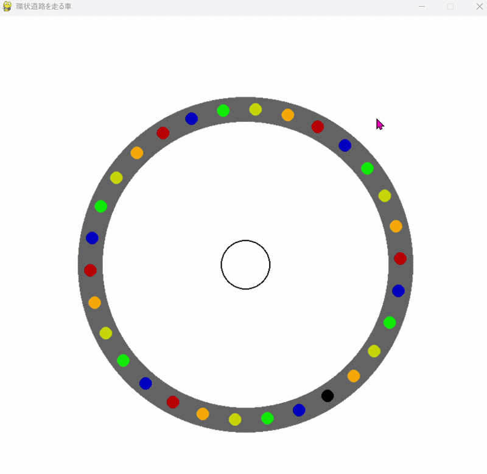

# traffic-jam-simulation

Pythonとpygameを使った、環状道路における幽霊渋滞のシミュレーションです。


## 概要

1台の車のブレーキが連鎖的なブレーキを引き起こし、渋滞が発生する現象（**幽霊渋滞**）をシミュレーションしています。

- 30台の車が環状道路を等間隔・同速度で走行
- 先頭の車がブレーキをかけると、後続の車が順番に減速
- 前の車が十分に進んだら、徐々に加速して発進
- 画面中央のボタンでブレーキのON/OFFを操作

## デモ




## 特徴

- 角度ベースの位置管理による環状道路の物理演算
- 急加速ではなく徐々に加速するリアルな挙動の実装
- マウスクリックによるブレーキのインタラクティブ操作
- 色分けされた車による連鎖反応の可視化

## 動作環境

- Python 3.x
- pygame

## インストール

```bash
pip install pygame
```

## 実行方法

```bash
python main.py
```

画面中央の円をクリックすると先頭車両のブレーキが作動します。

## 実装の工夫

- 各車が前の車との角度差を監視し、一定以上離れたら発進する仕組み
- `speed_up_gradually`カウンターによる徐々に加速するロジック
- 最後尾の車は角度が2πをまたぐ特殊ケースに対応するため、前の車の角度に2πを加算して距離を正しく計算

## 制作背景

事故や工事がなくても、1台のブレーキだけで渋滞の波が自己持続的に広がる「幽霊渋滞」の研究にインスパイアされて制作しました。ロジックはすべて自分で設計・実装しています。
